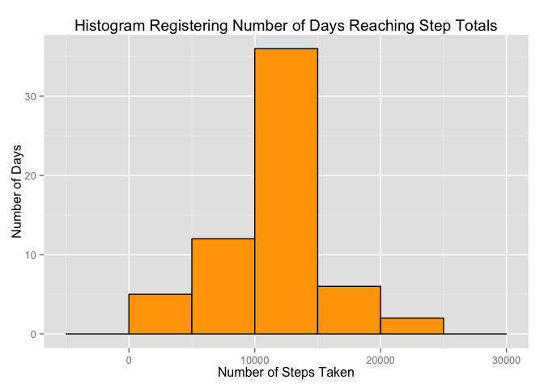
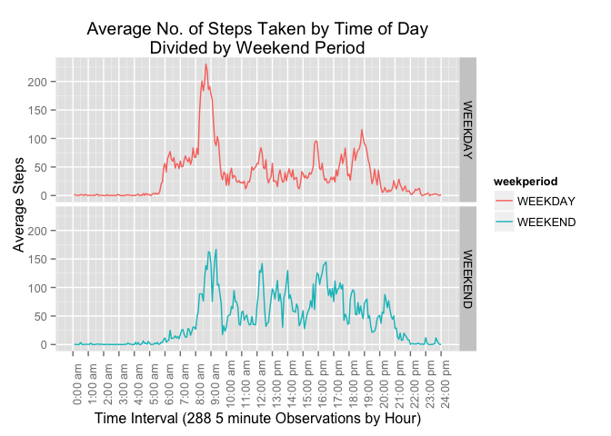

# Reproducible Data Coursera; Peer Assignment 1
Wesley Small  
August 8, 2015  


Preliminary activities, A, Load libraries DPLYR, LUBRIDATE AND GGPLOT2.

```
## 
## Attaching package: 'dplyr'
## 
## The following objects are masked from 'package:stats':
## 
##     filter, lag
## 
## The following objects are masked from 'package:base':
## 
##     intersect, setdiff, setequal, union
```

Helper functions created for tidy data/plotting; Setup for the step interval scale to the logical hour and associated label.

```r
intervalDivision <- split( 0:288, ceiling(seq_along(0:288)/12))
stepScaleBreaks <- function() { 
    output <- numeric(length = 25) 
    for(i in 1:25) 
        output[i] <-intervalDivision[[i]][1] 
    output
}
stepScaleLabels <- function() { 
    output <- numeric(length = 25) 
    for(i in 1:25) {
        dayPeriod <-"am"
        if (i > 13) dayPeriod <- "pm"
        output[i] <- paste0(i-1,":00 ", dayPeriod)
    }
    output
}
```
***
### TASK A "Load the data"
Load the dataset and perform some tranformations suitable for further analysis below.

```r
dfActivity <- read.csv("activity.csv")
```

Transformations to original dataset:

```r
dfActivity$date <- ymd(dfActivity$date)
dfActivity$date <- as.factor(dfActivity$date)
dfActivity$interval <- as.factor(dfActivity$interval) 
dtActivity <- tbl_df(dfActivity)
```

The Initial Activity dataset has the following structure:

```r
str(dfActivity)
```

```
## 'data.frame':	17568 obs. of  3 variables:
##  $ steps   : int  NA NA NA NA NA NA NA NA NA NA ...
##  $ date    : Factor w/ 61 levels "2012-10-01","2012-10-02",..: 1 1 1 1 1 1 1 1 1 1 ...
##  $ interval: Factor w/ 288 levels "0","5","10","15",..: 1 2 3 4 5 6 7 8 9 10 ...
```
***
### TASK 2: "What is mean total number of steps taken per day?""

```r
subsetDTActivityA <- 
    dtActivity %>% 
    select( date, steps) %>%
    filter( !is.na(steps)) %>%
    group_by(date) %>%
    summarise(
        tot_steps = sum(steps),
        avg_steps = mean(steps),
        med_steps = median(steps))
```
The histogram of the total number of steps taken each day

```r
qplot(
    subsetDTActivityA$tot_steps,
    binwidth = 500,
    geom = "histogram", 
    main = "Histogram Registering Number of Days Reaching Step Totals",
    xlab = "Number of Steps Taken",
    ylab = "Number of Days",
    fill = I("lightgreen"), 
    colour = I("black")) 
```

 

Calculate and report the mean and median total number of steps taken per day

```r
subsetDTActivityB <- 
  dtActivity %>% 
  select( interval, steps) %>%
  filter( !is.na(steps) ) %>%
  group_by(interval) %>%
  summarise(average_steps = mean(steps))

subsetDTActivityB$interval <- as.numeric(subsetDTActivityB$interval) 
#dtFinal$interval <- as.numeric(as.character(dtFinal$interval))

head(subsetDTActivityB)
```

```
## Source: local data frame [6 x 2]
## 
##   interval average_steps
## 1        1     1.7169811
## 2        2     0.3396226
## 3        3     0.1320755
## 4        4     0.1509434
## 5        5     0.0754717
## 6        6     2.0943396
```

***
### TASK 3: "What is the average daily activity pattern?"
Shown below is a time series plot (i.e. type = "l") of the 5-minute interval (x-axis) and the average number of steps taken, averaged across all days (y-axis):

```r
qplot(
      interval, 
      average_steps,
      data = subsetDTActivityB,
      geom = "line",
      main = "Average Number Step Rate Record Over A Day",
      xlab = "Hour of Day [Generated from 288 5 minute Observations]",
      ylab = "Average Steps Rate") + 
    scale_x_continuous(breaks = stepScaleBreaks(), labels=stepScaleLabels()) +
    theme(axis.text.x = element_text(angle=90))
```

 


```r
subsetDTActivityC <- 
    dtActivity %>% 
    select( interval, steps) %>%
    filter( !is.na(steps) ) %>%
    group_by(interval) %>%
    summarise(average_steps = mean(steps))
maxNumberSteps <- subsetDTActivityC[subsetDTActivityC$average_steps == max(subsetDTActivityC$average_steps),]
```
"Which 5-minute interval, on average across all the days in the dataset, contains the maximum number of steps?"

ANSWER: Time interval labelled: 835 has the maximum average number of steps at 206.1698113

***
### TASK 4: Inputing Missing Values


```r
sum(complete.cases(dtActivity) == FALSE)
```

```
## [1] 2304
```

```r
dtActivityComplete <- dtActivity[(complete.cases(dtActivity) == TRUE),]
dtActivityMissing <- dtActivity[(complete.cases(dtActivity) == FALSE),]

subsetDTActivityStepAvg <- 
  dtActivity %>% 
  select( interval, steps) %>%
  filter( !is.na(steps) ) %>%
  group_by(interval) %>%
  summarise(average_steps = mean(steps))

dtActivityMissingAvg <- inner_join(x = dtActivityMissing, y = subsetDTActivityStepAvg)
```

```
## Joining by: "interval"
```

```r
dtActivityMissingAvg$steps <- ceiling(dtActivityMissingAvg$average_steps)

dtActivityNotMissing <- dtActivityMissingAvg[, (colnames(dtActivityMissingAvg) %in% c("steps","date","interval"))]

dtActivityUpdated <- rbind(dtActivityComplete, dtActivityNotMissing)

subsetDTActivityUpdated <- 
  dtActivityUpdated %>% 
  select( date, steps) %>%
  filter( !is.na(steps) ) %>%
  group_by(date) %>%
  summarise(tot_steps = sum(steps),
            avg_steps = mean(steps),
            med_steps = median(steps))
```


```r
qplot(subsetDTActivityUpdated$tot_steps,
      binwidth = 500,
      geom = "histogram", 
      main = "Histogram Registering Number of Days Reaching Step Totals",
      xlab = "Number of Steps Taken",
      ylab = "Number of Days",
      fill = I("orange"), 
      colour = I("black")) 
```

 

***
### TASK 5: Activity patterns on weekdays vs. weekends?

```r
getWeekPeriod <- function(x) { 
    if (weekdays(as.POSIXct(x)) %in% c("Saturday","Sunday"))
        as.factor("WEEKEND") 
    else
        as.factor("WEEKDAY") 
}
dtFinal<- cbind(dtActivityUpdated, sapply(dtActivityUpdated$date,getWeekPeriod))
colnames(dtFinal) <- c("steps","date","interval","weekperiod")
str(dtFinal)
```

```
## 'data.frame':	17568 obs. of  4 variables:
##  $ steps     : num  0 0 0 0 0 0 0 0 0 0 ...
##  $ date      : Factor w/ 61 levels "2012-10-01","2012-10-02",..: 2 2 2 2 2 2 2 2 2 2 ...
##  $ interval  : Factor w/ 288 levels "0","5","10","15",..: 1 2 3 4 5 6 7 8 9 10 ...
##  $ weekperiod: Factor w/ 2 levels "WEEKDAY","WEEKEND": 1 1 1 1 1 1 1 1 1 1 ...
```

```r
dtFinal$interval <- as.numeric(dtFinal$interval)
dtFinalScrubbed <- 
    dtFinal %>% 
    group_by(weekperiod, interval) %>%
    summarise(average_steps = mean(steps))
str(dtFinalScrubbed)
```

```
## Classes 'grouped_df', 'tbl_df', 'tbl' and 'data.frame':	576 obs. of  3 variables:
##  $ weekperiod   : Factor w/ 2 levels "WEEKDAY","WEEKEND": 1 1 1 1 1 1 1 1 1 1 ...
##  $ interval     : num  1 2 3 4 5 6 7 8 9 10 ...
##  $ average_steps: num  2.289 0.533 0.289 0.311 0.222 ...
##  - attr(*, "vars")=List of 1
##   ..$ : symbol weekperiod
##  - attr(*, "drop")= logi TRUE
```


```r
p <- qplot(
        interval, 
        average_steps, 
        data = dtFinalScrubbed, 
        facets = weekperiod ~ . , 
        geom = "line",
        color = weekperiod,
        main = "Average No. of Steps Taken by Time of Day\nDivided by Weekend Period",
        xlab = "Time Interval (288 5 minute Observations by Hour)",
        ylab = "Average Steps") +
    scale_x_continuous(breaks = stepScaleBreaks(), labels=stepScaleLabels()) +
    theme(axis.text.x = element_text(angle=90))
p
```

 
