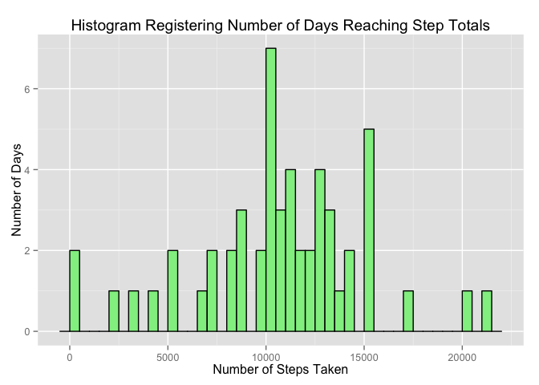

# Reproducible Data Courseral Peer Assignment 1
Wesley Small  
August 8, 2015  
### Background 
This assignment makes use of data from a personal activity monitoring device (fitbit. This device collects data at 5 minute intervals through out the day. The data consists of two months of data from an anonymous individual collected during the months of October and November, 2012 and include the number of steps taken in 5 minute intervals each day.

### About the Activity Data
The variables included in this dataset are:

* **steps**: Number of steps taking in a 5-minute interval (missing values are coded as NA)
* **date**: The date on which the measurement was taken in YYYY-MM-DD format
* **interval**: Identifier for the 5-minute interval in which measurement was taken

The dataset is stored in a comma-separated-value (CSV) file and there are a total of 17,568 observations in this dataset. The dataset is found at:
**https://d396qusza40orc.cloudfront.net/repdata%2Fdata%2Factivity.zip** 

### Preliminary activities

1. Load libraries DPLYR, LUBRIDATE AND GGPLOT2.


```r
library(dplyr)
library(lubridate)
library(ggplot2)
```

2. Helper functions created for tidy data/plotting; Setup for the step interval scale to the logical hour and associated label.

```r
intervalDivision <- split( 0:288, ceiling(seq_along(0:288)/12))

getStepScaleBreaks <- function() {
    # USED IN SETTING THE TICKS IN VARIOUS PLOTS BELOW
    output <- numeric(length = 25) 
    for(i in 1:25) 
        output[i] <-intervalDivision[[i]][1] 
    output
}

getStepScaleLabels <- function() {
    # USED IN SETTING THE TICK LABELS IN THE PLOTS BELOW BY TIME OF DAY HH:MM (am/pm)
    output <- numeric(length = 25) 
    for(i in 1:25) {
        dayPeriod <-"am"
        if (i > 13) dayPeriod <- "pm"
        output[i] <- paste0(i-1,":00 ", dayPeriod)
    }
    output
}
```

***
### TASK 1: "Load the data"
Load the dataset and perform some tranformations suitable for further analysis below.

```r
# HELPER TO LOAD DATASET (OR RETRIEVE FROM REMOTE LOCATION)
if (!"curl" %in% installed.packages()){ install.packages("curl") } 
getDatasetLoaded <- function(localFileName,remoteFilePath) {
    if(!file.exists(localFileName)) {
        message(localFileName)
        remoteFileName <- basename(remoteFilePath)
        message(remoteFileName)
        if (!file.exists(remoteFileName)) {
            message(remoteFilePath)
            downloadedTemporaryFile <- tempfile()
            
            library(curl)
            download.file(remoteFilePath,downloadedTemporaryFile,method="curl")
        }
        # [NOTE:] IF DOWNLOAD FILE ERROR OR STILL NOT EXIST, THEN STOP EXECUTION
        if (!"tools" %in% installed.packages()){ install.packages("tools") } 
        library(tools)
        if ( file_ext(remoteFileName) == "zip") { unzip(downloadedTemporaryFile) }
        # REMOVE TEMP FILE
        unlink(downloadedTemporaryFile)
    }
    read.csv(localFileName) # RETURN LOADED DATA.FRAME
}

dfActivity <- 
    getDatasetLoaded(
      "activity.csv", "https://d396qusza40orc.cloudfront.net/repdata%2Fdata%2Factivity.zip")
```

Transformations to original dataset:

```r
dfActivity$date <- ymd(dfActivity$date)
dfActivity$date <- as.factor(dfActivity$date)
dfActivity$interval <- as.factor(dfActivity$interval) 
dtActivity <- tbl_df(dfActivity)
```

The Initial Activity dataset has the following structure:

```r
str(dfActivity)
```

```
## 'data.frame':	17568 obs. of  3 variables:
##  $ steps   : int  NA NA NA NA NA NA NA NA NA NA ...
##  $ date    : Factor w/ 61 levels "2012-10-01","2012-10-02",..: 1 1 1 1 1 1 1 1 1 1 ...
##  $ interval: Factor w/ 288 levels "0","5","10","15",..: 1 2 3 4 5 6 7 8 9 10 ...
```
***
### TASK 2: "What is mean total number of steps taken per day?""

```r
subsetDTActivityA <- 
    dtActivity %>%
    na.omit() %>%
    select( date, steps) %>%
    filter(!(is.na(steps) | is.nan(steps))) %>%
    group_by(date) %>%
    summarise(total_steps = sum(steps))
```
The histogram of the total number of steps taken each day. 

```r
qplot(
    subsetDTActivityA$total_steps,
    binwidth = 5000,
    geom = "histogram", 
    main = "Histogram Registering Number of Days Reaching Step Totals",
    xlab = "Number of Steps Taken",
    ylab = "Number of Days",
    fill = I("red"), 
    colour = I("black")) 
```

 
This auxillary histogram breaks shows each division by 100 step divisions.

```r
qplot(
    subsetDTActivityA$total_steps,
    binwidth = 500,
    geom = "histogram", 
    main = "Histogram Registering Number of Days Reaching Step Totals",
    xlab = "Number of Steps Taken",
    ylab = "Number of Days",
    fill = I("lightgreen"), 
    colour = I("black")) 
```

 

####SUBTASK: Calculate and report the mean and median total number of steps taken per day.

```r
# Calculate Median and Mean of Total Steps per Day.
averageSteps <- mean(subsetDTActivityA$total_steps)
medianSteps <- median(subsetDTActivityA$total_steps)
```
####RESULTS:
The average number of total steps is 1.0766189\times 10^{4}
The median number of total steps is 10765

This table is a break down of the steps per day used in the calculations above.

```r
stepReport <- subsetDTActivityA %>%
                select(date,total_steps)
knitr::kable(stepReport, format = "markdown")
```


|date       | total_steps|
|:----------|-----------:|
|2012-10-02 |         126|
|2012-10-03 |       11352|
|2012-10-04 |       12116|
|2012-10-05 |       13294|
|2012-10-06 |       15420|
|2012-10-07 |       11015|
|2012-10-09 |       12811|
|2012-10-10 |        9900|
|2012-10-11 |       10304|
|2012-10-12 |       17382|
|2012-10-13 |       12426|
|2012-10-14 |       15098|
|2012-10-15 |       10139|
|2012-10-16 |       15084|
|2012-10-17 |       13452|
|2012-10-18 |       10056|
|2012-10-19 |       11829|
|2012-10-20 |       10395|
|2012-10-21 |        8821|
|2012-10-22 |       13460|
|2012-10-23 |        8918|
|2012-10-24 |        8355|
|2012-10-25 |        2492|
|2012-10-26 |        6778|
|2012-10-27 |       10119|
|2012-10-28 |       11458|
|2012-10-29 |        5018|
|2012-10-30 |        9819|
|2012-10-31 |       15414|
|2012-11-02 |       10600|
|2012-11-03 |       10571|
|2012-11-05 |       10439|
|2012-11-06 |        8334|
|2012-11-07 |       12883|
|2012-11-08 |        3219|
|2012-11-11 |       12608|
|2012-11-12 |       10765|
|2012-11-13 |        7336|
|2012-11-15 |          41|
|2012-11-16 |        5441|
|2012-11-17 |       14339|
|2012-11-18 |       15110|
|2012-11-19 |        8841|
|2012-11-20 |        4472|
|2012-11-21 |       12787|
|2012-11-22 |       20427|
|2012-11-23 |       21194|
|2012-11-24 |       14478|
|2012-11-25 |       11834|
|2012-11-26 |       11162|
|2012-11-27 |       13646|
|2012-11-28 |       10183|
|2012-11-29 |        7047|

***
### TASK 3: "What is the average daily activity pattern?"
Shown below is a time series plot (i.e. type = "l") of the 5-minute interval (x-axis) and the average number of steps taken, averaged across all days (y-axis):

```r
# SUMMARIZE DATASET TO OBTAIN AVERAGE STEPS
subsetDTActivityB <- 
  dtActivity %>% 
  select( interval, steps) %>%
  filter( !is.na(steps) ) %>%
  group_by(interval) %>%
  summarise(average_steps = mean(steps))

subsetDTActivityB$interval <- as.numeric(subsetDTActivityB$interval) 
```

```r
qplot(
      interval, 
      average_steps,
      data = subsetDTActivityB,
      geom = "line",
      main = "Average Number Step Rate Record Over A Day",
      xlab = "Hour of Day [Generated from 288 5 minute Observations]",
      ylab = "Average Steps Rate") + 
    scale_x_continuous(breaks = getStepScaleBreaks(), labels = getStepScaleLabels()) +
    theme(axis.text.x = element_text(angle=90))
```

 

#### "Which 5-minute interval, on average across all the days in the dataset, contains the maximum number of steps?"

```r
subsetDTActivityC <- 
    dtActivity %>% 
    select( interval, steps) %>%
    filter( !is.na(steps) ) %>%
    group_by(interval) %>%
    summarise(average_steps = mean(steps))
maxNumberSteps <- subsetDTActivityC[subsetDTActivityC$average_steps == max(subsetDTActivityC$average_steps),]
```
####ANSWER: 
Time interval labelled: 835 has the maximum average number of steps at 206.1698113

***
### TASK 4: Imputing Missing Values
Replacing the NAs in step count with averages of the total step count.  The Averages are rounded up to the nearest whole integer number.

In the provided Activity dataset, there are 2304 records that have a step count missing out of the total 17568


```r
# FILTER FOR COMPLETE VS INCOMPLETE
dtActivityComplete <- dtActivity[(complete.cases(dtActivity) == TRUE),]
dtActivityMissing <- dtActivity[(complete.cases(dtActivity) == FALSE),]

# CALCULATE INTERVAL BASED STEP AVERAGES
subsetDTActivityStepAvg <- 
  dtActivity %>%
  select( interval, steps) %>%
  group_by(interval) %>%
  summarise(average_steps = mean(steps, na.rm = TRUE))

# LEFT JOIN THE AVERAGES TO INCOMPLETE CASES
dtActivityMissingAvg <- inner_join(x = dtActivityMissing, y = subsetDTActivityStepAvg)
# ROUND UP THE AVERAGES AND ASSIGN TO THE STEPS COLUMN
dtActivityMissingAvg$steps <- ceiling(dtActivityMissingAvg$average_steps)

# OBTAIN A NEW DATASET FOR THE FIXED MISSING CASES
dtActivityNotMissing <- dtActivityMissingAvg[, (colnames(dtActivityMissingAvg) %in% c("steps","date","interval"))]

# RECREATE A NEW COMPLETE DATASET
dtActivityUpdated <- rbind(dtActivityComplete, dtActivityNotMissing)

# SUMMARIZE THE STEPS BY TOTAL #, AVERAGE AND MEDIAN
subsetDTActivityUpdated <- 
  dtActivityUpdated %>% 
  select( date, steps) %>%
  group_by(date) %>%
  summarise(total_steps = sum(steps))
```
#### SUBTASK: Make a histogram of the total number of steps taken each day 

```r
# PLOT COMPLETE CASES DATASET
qplot(subsetDTActivityUpdated$total_steps,
      binwidth = 5000,
      geom = "histogram", 
      main = "Histogram Registering Number of Days Reaching Step Totals",
      xlab = "Number of Steps Taken",
      ylab = "Number of Days",
      fill = I("orange"), 
      colour = I("black")) 
```

 

#### SUBTASK: Calculate and report the mean and median total number of steps taken per day. 

```r
# Calculate Median and Mean of Total Steps per Day for the Imputed Data
imputedAverageSteps <- mean(subsetDTActivityUpdated$total_steps)
imputedMedianSteps <- median(subsetDTActivityUpdated$total_steps)
```

####RESULTS:
The new average number of total steps within the imputed data is 1.0784918\times 10^{4}
The new median number of total steps within the imputed data is 1.0909\times 10^{4}

#### QUERIES:
**Do these values differ from the estimates from the first part of the assignment?**

```r
differenceAverageSteps <- imputedAverageSteps - averageSteps
differenceMedianSteps <- imputedMedianSteps - medianSteps

plusMinusNone <- function(x) { if (x == 0 ) abs(x) else if (x < 0) x else paste0("+",abs(x)) }

dfDifference <- 
  as.data.frame(
    rbind(
    c('Average Total Steps',averageSteps,imputedAverageSteps,plusMinusNone(differenceAverageSteps)),
    c('Median Total Steps',medianSteps,imputedMedianSteps,plusMinusNone(differenceMedianSteps))
    ))

colnames(dfDifference) <- 
    c('Tally Category','Original Estimate','Imputed New Estimate','Resultant Change/Difference')

knitr::kable(dfDifference, format = "markdown")
```


|Tally Category      |Original Estimate |Imputed New Estimate |Resultant Change/Difference |
|:-------------------|:-----------------|:--------------------|:---------------------------|
|Average Total Steps |10766.1886792453  |10784.9180327869     |+18.7293535416029           |
|Median Total Steps  |10765             |10909                |+144                        |

**What is the impact of imputing missing data on the estimates of the total daily number of steps?**

```r
highLowSame <- 
    function(x) { if (x == 0 ) "No Difference" 
                  else if (x < 0) paste(x,"Lower") 
                  else paste(x,"Higher") }
```
A) Average of Total Steps: 18.7293535416029 Higher
B) Medium of Total Steps: 144 Higher

####CONCLUSION...
**By filling the in gaps where the NA were found, with the gratiously rounded up averages, we saw a relatively increase in the averages and medium.**

***
### TASK 5: Activity patterns on weekdays vs. weekends?
The follow is the logic used to add the Weekend Vs Weekend Factor Categorical factors into the data.

```r
# CREATE NEW FUNCTION TO RETURN THE FACTOR BASED ON THE WEEKDAYS FUNCTION
getWeekPeriod <- function(x) { 
    if (weekdays(as.POSIXct(x)) %in% c("Saturday","Sunday"))
        as.factor("WEEKEND") 
    else
        as.factor("WEEKDAY") 
}
# BIND THE NEW CONTENT TO THE EXISTING TABLE
dtFinal<- cbind(dtActivityUpdated, sapply(dtActivityUpdated$date,getWeekPeriod))
colnames(dtFinal) <- c("steps","date","interval","weekperiod")

# CALCULATE THE AVERAGES GROUPED BY WEEK-PERIOD, AND INTERVAL
dtFinal$interval <- as.numeric(dtFinal$interval)
dtFinalScrubbed <- 
    dtFinal %>% 
    group_by(weekperiod, interval) %>%
    summarise(average_steps = mean(steps))
```

The following is the plot showing the activity level differences on the weekend vs the work week days.

```r
p <- qplot(
        interval, 
        average_steps, 
        data = dtFinalScrubbed, 
        facets = weekperiod ~ . , 
        geom = "line",
        color = weekperiod,
        main = "Average No. of Steps Taken by Time of Day\nDivided by Weekend Period",
        xlab = "Time Interval (288 5 minute Observations by Hour)",
        ylab = "Average Steps") +
    scale_x_continuous(breaks = getStepScaleBreaks(), labels = getStepScaleLabels()) +
    theme(axis.text.x = element_text(angle=90))
p
```

 
